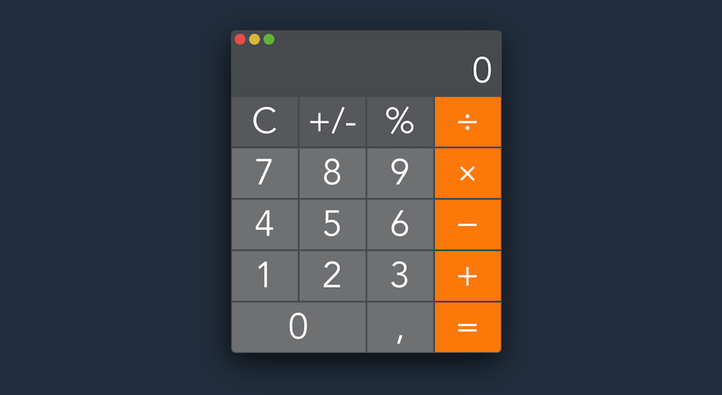

# vue-calculator

Простейший калькулятор, стилизованный под калькулятор на macOS.

Node, Vue, Babel, BEM



PS: некоторые функции требуют доработки

## Настройка
```
npm install
```

### Сборка для разработки с hot-reload
```
npm run serve
```

### Сборка для продакшена
```
npm run build
```

### Линтинг
```
npm run lint
```


